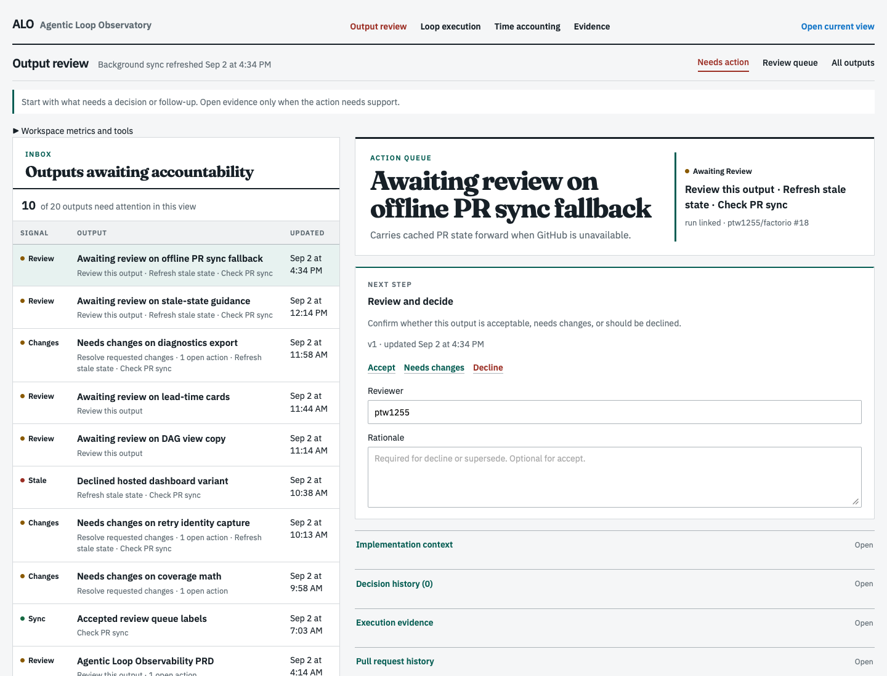
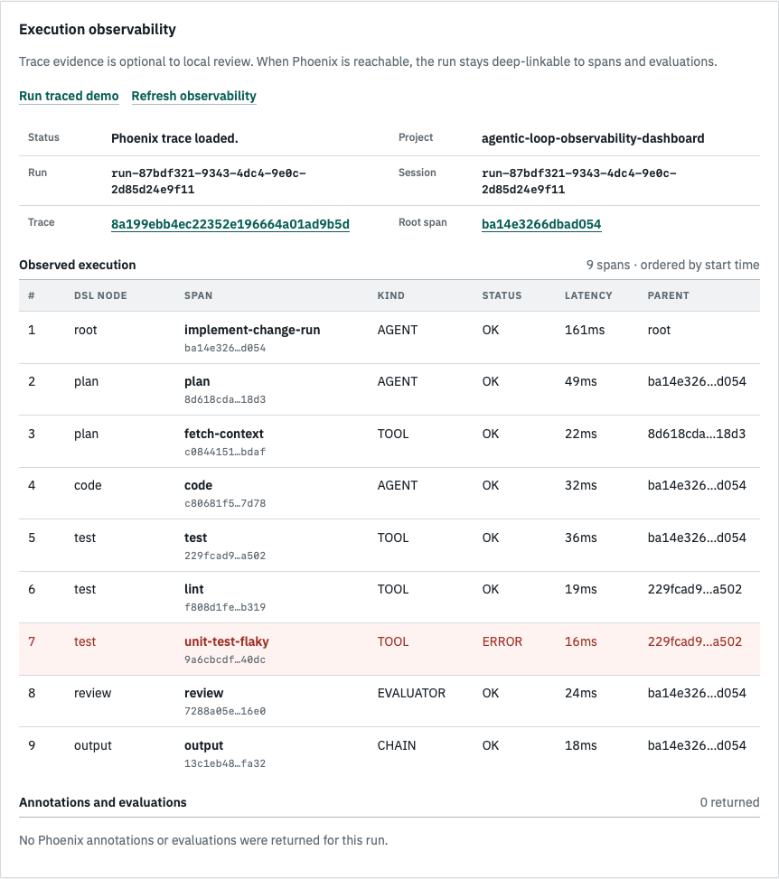
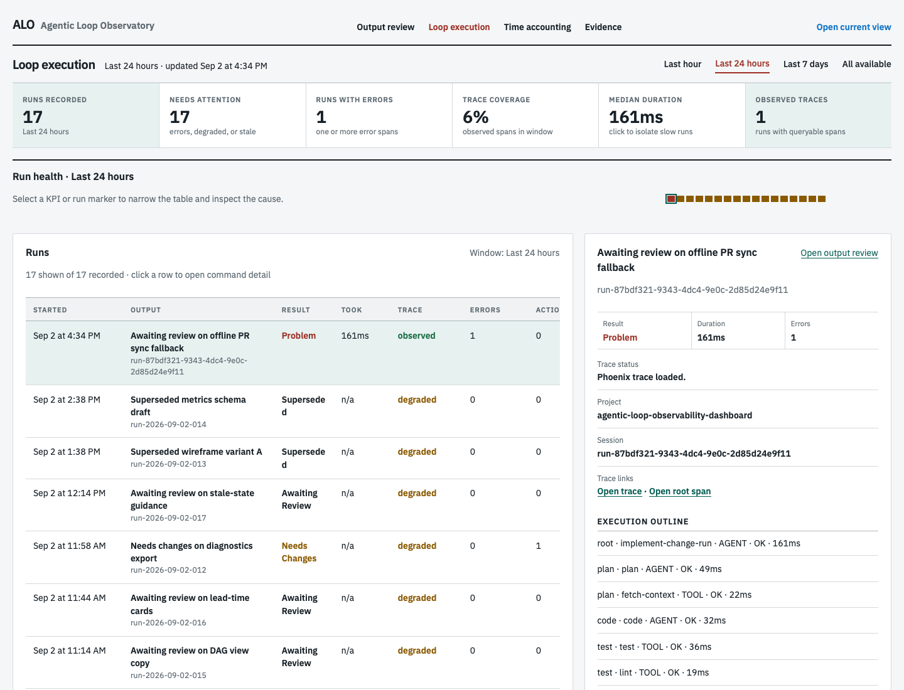
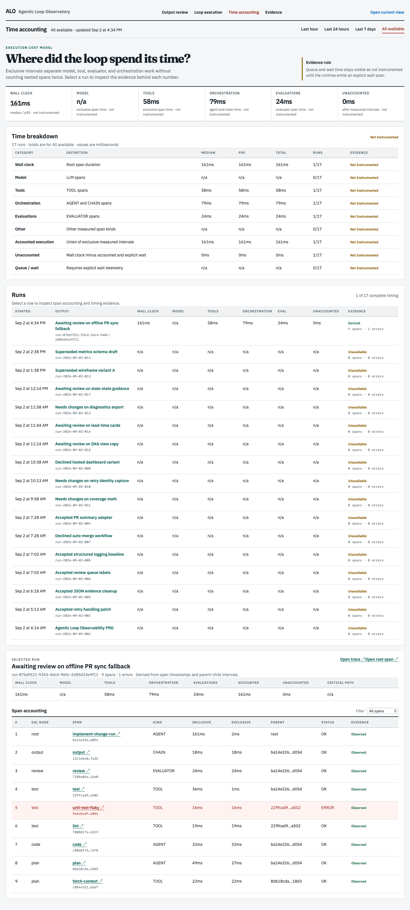
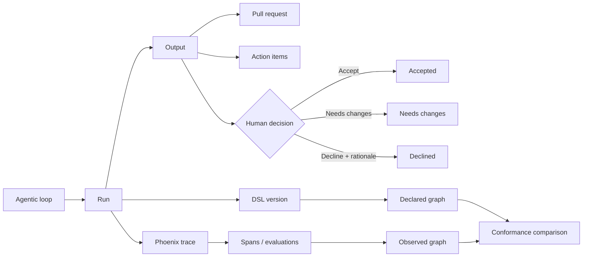

# Agentic Loop Observability Dashboard

> A local control plane for turning agent work into reviewable, accountable, and observable product outcomes.

Agentic systems produce more than text. They create plans, artifacts, pull requests, action items, tool calls, retries, evaluations, and decisions. This product gives that work one durable review surface: a browser-based local app where a person can understand what happened, decide what ships, and inspect the evidence behind the result.

## Why this product exists

Agent work is usually split across chat history, terminals, GitHub, task trackers, and trace viewers. That fragmentation makes simple questions expensive to answer:

- What did the agent actually produce?
- Which pull request and follow-up actions belong to this output?
- Was it accepted, declined, or sent back for changes?
- Which loop nodes, tools, and functions ran?
- Where did the run fail, retry, or diverge from the declared workflow?
- Which claims are observed, derived, or still missing evidence?

The dashboard joins those answers by stable output, run, session, trace, and DSL identifiers. It is intentionally local-first: the review record remains useful when external systems or observability services are unavailable.

## The product promise

**One output. One review surface. Complete accountability.**

The MVP helps a reviewer move from inbox to decision in one flow:

1. Find the output that needs attention.
2. Read its objective, artifacts, PR context, and action items.
3. Compare the declared agent workflow with the observed execution.
4. Inspect latency, status, tool paths, annotations, and telemetry gaps.
5. Record `Accepted`, `Declined`, or `Needs changes` with an auditable rationale.

## Product tour

The current seeded pilot contains 20 representative outputs across draft, awaiting review, needs changes, accepted, declined, stale, failed, and superseded states.

### Snapshot: review inbox



The landing inbox is action-first: it defaults to outputs needing a decision, follow-up, stale-state refresh, or PR-sync remediation. The selected item leads with the next step; implementation context, decision history, execution evidence, PR history, and output evidence open only when needed.

### Snapshot: loop detail



The loop view turns a trace into a review artifact: trace identity, latency, execution order, parent-child structure, tool failures, and evaluations are visible without leaving the output record.

### Snapshot: loop execution command center



The dedicated command center is the fast path for operators. It starts with time-windowed KPIs, a compact health strip, and a run table. Selecting **Needs attention**, **Runs with errors**, **Trace coverage**, or **Median duration** narrows the table so an odd KPI becomes an actionable investigation queue. Selecting a run opens its trace, span, annotation, and DSL conformance detail alongside the table.

### Snapshot: time accounting



The time-accounting view answers a narrower operational question: where did the loop spend its time? It reports wall-clock, model, tool, orchestration, evaluator, accounted, unaccounted, and queue/wait measurements for a named time window. Selecting a run opens a span-level table with inclusive and exclusive duration, DSL node, parent, status, evidence state, and Phoenix deep links.

The images above are captured from the running product with Playwright’s WebKit engine, the Safari-compatible automation target. Recreate them locally with `npm run capture:snapshots`.

### Interaction model

The interface is deliberately organized around rows and columns:

- top navigation links move between review, loop execution, and evidence views;
- KPI columns summarize the current pilot without hiding denominators;
- the landing output inbox defaults to a scan-first table of items needing action, with review and all-output filters available;
- selecting an output opens its detail record without losing the queue context;
- the selected output leads with one next-step panel and keeps secondary context behind explicit disclosures;
- the loop execution command center adds time-window filters and KPI-driven run focus;
- the time-accounting window separates nested span time into model, tool, orchestration, evaluator, and explicit wait categories;
- review, PR, trace, and evidence controls are plain text actions with explicit labels;
- execution and conformance data use side-by-side columns and tabular evidence;
- status is communicated with text and small state markers, not decorative button chrome.

## Core surfaces

| Surface | What it answers |
| --- | --- |
| Output inbox | What needs review now, and how is the queue distributed by state? |
| Output detail | What was produced, what version is current, and what evidence is attached? |
| Review actions | What should the human decide, and what rationale makes that decision auditable? |
| Action items | What follow-up work remains, who owns it, and what completion evidence exists? |
| PR context | Which pull request is connected, what is its cached state, and is it stale or offline? |
| Decision ledger | What decisions were made, by whom, when, and against which output version? |
| Execution observability | Which agents, chains, evaluators, tools, and functions ran, in what order, and for how long? |
| Span tree and outline | What is the parent-child execution structure and the human-readable path through the loop? |
| DSL conformance | Did observed execution match the declared workflow graph? |
| Telemetry coverage | Which signals are observed, missing, derived, or degraded? |
| Time accounting | Where did the loop spend time, and which timing claims are actually supported by spans? |
| JSON evidence | Can a reviewer inspect exact structured output, provenance, schema, and missingness? |
| Export and diagnostics | Can local state be backed up, restored, replayed, and diagnosed without hidden state? |

## How a reviewer uses it

### 1. Triage the inbox

The output table groups records by their current human-review state. Each row keeps the key context visible: output type, creator, run linkage, PR linkage, open actions, and stale-state messaging.

### 2. Establish product context

The detail view starts with the output objective and current version. The reviewer can inspect artifacts, their schemas, provenance labels, capture timestamps, content hashes, and explicit missingness.

### 3. Separate implementation state from decision state

GitHub pull-request state is displayed as implementation context. `Accepted` and `Declined` remain human decisions in the append-only event ledger; neither is inferred from merge state, checks, or model evaluation.

### 4. Scan the execution command center

Open `/loop-execution.html` to see all linked runs in a dedicated operational view. Start with the selected time window, scan the KPI row, and use a KPI as a focus filter when something looks unusual. The run health strip provides a compact chronological signal; the table provides the accountable row to investigate.

### 5. Follow the agent loop

Selecting a run in the command center queries Phoenix for spans using the output and run correlation fields. It renders:

- a chronological execution outline;
- a parent-child span tree;
- trace and root-span deep links;
- span kind, status, latency, and explicit DSL node IDs;
- annotations and evaluations when the connected Phoenix version supports them.

### 6. Account for execution time

Open `/time-accounting.html` to compare timing across a selected window. The view uses interval unions and exclusive child subtraction so nested and parallel spans do not inflate totals. A timing claim is marked `derived` only when the required span timestamps exist; incomplete timing stays `not_instrumented`, and Phoenix outages stay `unavailable`. Queue/wait time is never inferred from idle gaps.

### 7. Compare declared and observed behavior

The versioned loop DSL is the declared contract. The Phoenix trace is the observed record. The conformance view keeps both graphs visible, identifies missing or unexpected nodes and edges, and withholds critical-path claims when timing or graph completeness is insufficient.

### 8. Make the decision durable

The reviewer records `Accept`, `Needs changes`, or `Decline`. Declines require a rationale. Events are append-only and projected into current state, so the decision survives a restart and remains exportable.

## Data and identity model



The key join fields are:

| Field | Purpose |
| --- | --- |
| `output_id` | Stable product object under review |
| `run_id` | One execution attempt that produced or changed the output |
| `session_id` | Groups related trace activity |
| `alo.loop_definition_id` | Identifies the declared loop |
| `alo.dsl_version` | Makes the declaration reproducible |
| `alo.dsl.node_id` | Maps an observed span to a declared node |
| `trace_id` / `root_span_id` | Deep-linkable Phoenix evidence |

## Local-first architecture

```text
Agent runtime ── OTLP/OpenInference ──> Phoenix (local)
      │                                     │
      │ output/action events                │ spans, annotations, evals
      v                                     v
Local TypeScript service ───────────────> Adapter/query layer
      │                                     │
      ├── SQLite: events and projections     ├── Phoenix client
      ├── JSON/file artifacts                └── GitHub CLI adapter
      └── Browser UI
```

The local service owns the review model and durability boundary. Phoenix owns execution telemetry. The GitHub adapter owns PR synchronization and cached snapshots. Each external dependency can degrade independently while the local review record remains usable.

## Loop execution command center

The command center is a separate HTML/TypeScript page at `/loop-execution.html`. It is designed for a different question than the output review page:

| Review page | Command center |
| --- | --- |
| What is this output, and should it ship? | Which runs look unusual right now? |
| Inspect one output’s PR, artifacts, actions, and decision ledger | Compare runs across a time window |
| Record a human decision | Focus odd KPIs into a run queue |
| Drill into the output record | Drill into trace spans, errors, latency, and DSL conformance |

Supported windows are `Last hour`, `Last 24 hours`, `Last 7 days`, and `All available`. KPI filters are local and reversible: `Needs attention`, `Runs with errors`, `Trace coverage`, and `Median duration`. The command center stays useful when Phoenix is degraded by showing the run and marking trace evidence as degraded instead of dropping the row.

## Run the product locally

Requirements: Node.js 20+, npm, and optionally Docker for the pinned Phoenix deployment.

```bash
npm install
npm run build
npm run start
```

Open `http://localhost:4173`.

For a clean seeded pilot database:

```bash
DASHBOARD_DB_PATH=/tmp/alo-dashboard.sqlite PORT=4174 npm run start
```

To add local Phoenix trace capture:

```bash
npm run phoenix:up
```

Then use **Run traced demo** from an output with a linked run. If Phoenix is unavailable, the output, decision workflow, artifacts, and cached PR state remain reviewable; observability is shown as degraded rather than silently omitted.

Useful commands:

```bash
npm test                 # Unit and projection tests
npm run typecheck        # TypeScript validation
npm run build            # Browser bundle and server build
npm run pilot:run        # Seed and exercise the local pilot loop
npm run capture:snapshots # Capture WebKit/Safari-compatible product views
```

## Contracts and implementation status

The repository is both a working local MVP and a reference implementation plan. The contracts are versioned so agent runtimes can adopt the join model incrementally.

- [Outcome-led PRD](docs/PRD.md)
- [Architecture and ownership boundaries](docs/ARCHITECTURE.md)
- [Telemetry and Phoenix contract](docs/TELEMETRY-CONTRACT.md)
- [Dashboard and loop-detail wireframes](docs/WIREFRAMES.md)
- [JSON visualization acceptance criteria](docs/VISUALIZATION-ACCEPTANCE-CRITERIA.md)
- [Ordered MVP implementation plan](docs/MVP-IMPLEMENTATION-PLAN.md)
- [Operations runbook](docs/OPERATIONS-RUNBOOK.md)
- [Threat model](docs/THREAT-MODEL.md)
- [Machine-readable event schema](schemas/domain-event.schema.json)
- [Machine-readable observability schema](schemas/agentic-loop-observability.schema.json)
- [Example stateful loop capture](examples/loop-run.example.json)

Implemented in the current MVP:

- append-only event store and deterministic current-state projections;
- browser UI for inbox, output detail, actions, decisions, PR state, and evidence;
- versioned decision vocabulary and pilot-loop DSL;
- local GitHub PR linking, cached snapshots, auth/rate-limit/offline handling;
- Phoenix/OpenInference trace capture, execution outline, span tree, and deep links;
- span-derived time accounting with nested-span subtraction, parallel interval union, time-window KPIs, and run/span drill-down;
- resilient Phoenix fallback with explicit degraded annotation coverage;
- declared-versus-observed DSL conformance and critical-path safeguards;
- validated JSON evidence views with provenance, schema status, and missingness;
- state export/restore, migration metadata, diagnostics bundles, and recovery drills.

## Scope boundaries

The MVP intentionally does not attempt to replace the Phoenix trace UI, host a multi-user control plane, autonomously merge pull requests, or become a generalized workflow authoring system. Its job is narrower and more valuable: make agent outputs reviewable, decisions durable, and loop evidence understandable in one local surface.

## Related work

- [`ptw1255/agent-task-dashboard`](https://github.com/ptw1255/agent-task-dashboard) demonstrates the lightweight local dashboard pattern and Apple-inspired interaction direction.
- [`ptw1255/Kiro-Observability`](https://github.com/ptw1255/Kiro-Observability) is a candidate agent-loop adapter for mapping runtime telemetry into this contract.
- [`ptw1255/Skill-Clean-Data-Presentation`](https://github.com/ptw1255/Skill-Clean-Data-Presentation) defines the evidence-presentation standard for charts, graphs, tables, and JSON views.

## License

See [LICENSE](LICENSE).
