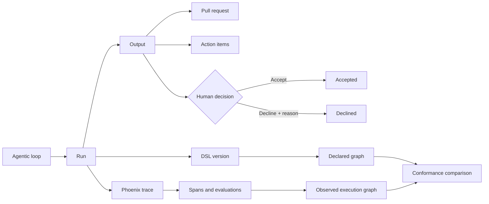
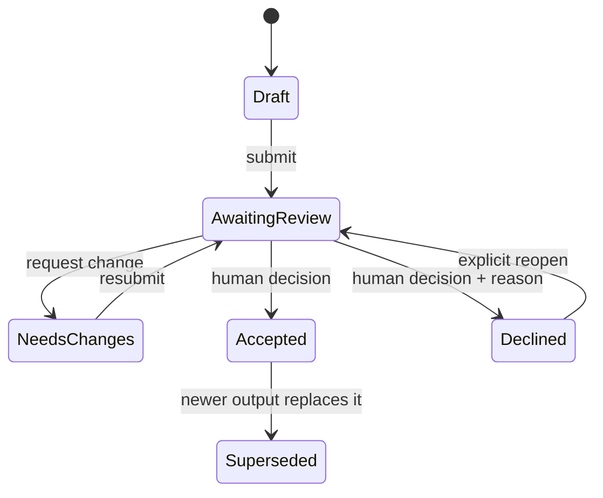

# Agentic Loop Observability Dashboard

> A local control plane for reviewing what agents produced, deciding what ships, and tracing every output back through the loop that created it.

## The product outcome

Agent work should not disappear into chat history, terminal output, or disconnected pull requests. This product creates one durable review surface where a person can answer:

1. What did the agent produce?
2. Which pull request and action items belong to it?
3. Was the output accepted or declined, by whom, and why?
4. Which agent, model, function, and tool path produced it?
5. Where did the loop spend time, fail, retry, or deviate from its declared DSL?
6. Is the evidence complete enough to trust the view?

The MVP is a browser-based local web app. Product state is stored locally. Agent traces and evaluations are supplied by Arize Phoenix through OpenTelemetry and OpenInference.

## The experience in one view

```text
┌──────────────────────────────────────────────────────────────────────────┐
│ Agentic Loop Observatory     12 awaiting review   67% accepted   Updated │
├──────────────────────┬───────────────────────────────────────────────────┤
│ OUTPUTS              │ Selected output: Add retry policy                 │
│ ○ Awaiting review 12 │ PR #184 · open · 3 files · Agent run 9e41         │
│ ✓ Accepted        31 │ [Accept] [Decline] [Request change]               │
│ × Declined         4 ├───────────────────────────────────────────────────┤
│                      │ ACTIONS     2 open / 5 total                       │
│ PR #184  Awaiting    │ □ Validate backoff  □ Add timeout evidence        │
│ PR #179  Accepted    ├───────────────────────────────────────────────────┤
│ PR #173  Declined    │ EXECUTION — declared DSL vs observed trace         │
│                      │ plan → code → test → review → output               │
│                      │  42ms   8.4s   2.1s    1.3s                        │
│                      ├───────────────────────────────────────────────────┤
│                      │ Evidence: 94% captured · 2 telemetry gaps          │
└──────────────────────┴───────────────────────────────────────────────────┘
```

## Product model



## MVP surfaces

| Surface | Decision it supports |
| --- | --- |
| Output inbox | What needs review now? |
| Output detail | What changed, what evidence exists, and what remains open? |
| PR tracker | Where is the implementation in the GitHub lifecycle? |
| Accept/decline ledger | What decision was made, by whom, when, and with what rationale? |
| Loop observability | Which tools/functions ran, in what order, for how long, and with what result? |
| DSL conformance | Did the observed run match the declared workflow? |
| JSON evidence views | Can a reviewer inspect structured output without losing source, scope, or exact values? |
| Telemetry coverage | Which claims are observed, derived, or unavailable? |

## Recommended MVP architecture

```text
Agent runtimes ──OTLP/OpenInference──> Arize Phoenix (local)
      │                                      │
      │ output/action events                 │ spans, annotations, evals
      v                                      v
Local web service ─────────────────────> Adapter/query layer
      │                                      │
      ├── SQLite: state + decisions           ├── Phoenix client/REST API
      ├── Artifact directory: JSON/files      └── GitHub API polling
      └── Browser: HTML/CSS/TypeScript
```

The proposed implementation is local-first:

- browser UI served from `localhost`;
- a small TypeScript service for APIs, ingestion, GitHub sync, and Phoenix queries;
- SQLite for outputs, actions, decisions, PR snapshots, DSL versions, and trace links;
- Phoenix in a pinned local container for traces, spans, annotations, and evaluations;
- no GitHub Actions or hosted runner dependency for the MVP.

## State model

`Accepted` and `Declined` are human decisions, not aliases for GitHub merge state or automated evaluation results.



## What is already specified

- [Outcome-led PRD](docs/PRD.md)
- [Architecture and ownership boundaries](docs/ARCHITECTURE.md)
- [Telemetry, Phoenix, and DSL contract](docs/TELEMETRY-CONTRACT.md)
- [Dashboard and loop-detail wireframes](docs/WIREFRAMES.md)
- [JSON visualization acceptance criteria](docs/VISUALIZATION-ACCEPTANCE-CRITERIA.md)
- [Ordered MVP implementation plan](docs/MVP-IMPLEMENTATION-PLAN.md)
- [Operations runbook](docs/OPERATIONS-RUNBOOK.md)
- [Threat model](docs/THREAT-MODEL.md)
- [Machine-readable schema](schemas/agentic-loop-observability.schema.json)
- [Example stateful capture](examples/loop-run.example.json)

## MVP definition of done

The MVP is complete when a reviewer can open one local URL, select an output, inspect its PR and action items, see the declared and observed loop paths, review duration/error/evaluation evidence, inspect the underlying JSON, and record an auditable accept or decline decision that survives restart.

The first release intentionally excludes remote multi-user hosting, autonomous merge, generalized workflow authoring, and an attempt to replace the full Phoenix trace UI.

## Related work

- [`ptw1255/agent-task-dashboard`](https://github.com/ptw1255/agent-task-dashboard) demonstrates the lightweight local dashboard pattern and Apple-inspired interaction direction.
- [`ptw1255/Kiro-Observability`](https://github.com/ptw1255/Kiro-Observability) is a candidate agent-loop adapter and already exposes local telemetry concepts that can be mapped into the contract.
- [`ptw1255/Skill-Clean-Data-Presentation`](https://github.com/ptw1255/Skill-Clean-Data-Presentation) is the required evidence-presentation standard for every chart, graph, table, and JSON view.

## Run it locally

```bash
npm install
npm run phoenix:up
npm run build
npm run start
```

Open `http://localhost:4173`.

To run a clean seeded pilot without touching an existing local database:

```bash
DASHBOARD_DB_PATH=/tmp/alo-dashboard.sqlite PORT=4174 npm run start
```

The current MVP slice includes:

- a local TypeScript service and semantic HTML/CSS/TypeScript browser UI;
- SQLite-backed append-only events, versioned migrations, and deterministic current-state projections;
- seeded 20-output pilot data covering accepted, declined, needs-changes, stale, failed, and superseded slices;
- denominator-based pilot metrics for review completeness, trace linkage, DSL mapping coverage, and review lead time;
- append-only accept, decline, and needs-changes decisions;
- local GitHub pull-request linking, sync, cached snapshots, and failure-state capture through the `gh` CLI;
- pinned local Phoenix deployment config, OpenInference instrumentation hooks, and degraded observability fallback when Phoenix is unavailable;
- Phoenix-backed execution outline, parent or child tree rendering, and deep-link generation for traces and spans;
- declared-versus-observed DSL conformance with explicit divergence and critical-path withholding rules;
- export and restore of local state with a diagnostics-backed replay drill;
- structured NDJSON request logs and downloadable diagnostics bundles;
- JSON evidence views with compact, table, tree, and raw modes plus schema validation, provenance, and stable deep-link restoration.

## Current execution status

Implemented now:

- `#4` Freeze v1 contracts
- `#1` Append-only event store and projections
- `#2` MVP browser UI vertical slice
- `#3` Review policy, privacy defaults, and backup or restore path
- `#8` Phoenix-backed execution outline, tree view, and trace deep-links
- `#9` JSON evidence presentation: validated, inspectable, and deep-linkable views
- `#10` Versioned DSL conformance and declared-versus-observed DAG analysis
- `#11` Pilot hardening, diagnostics, migrations, and operational recovery

Still pending:

- live happy-path Phoenix startup verification on this machine still requires a working local Docker daemon or equivalent Phoenix runtime
