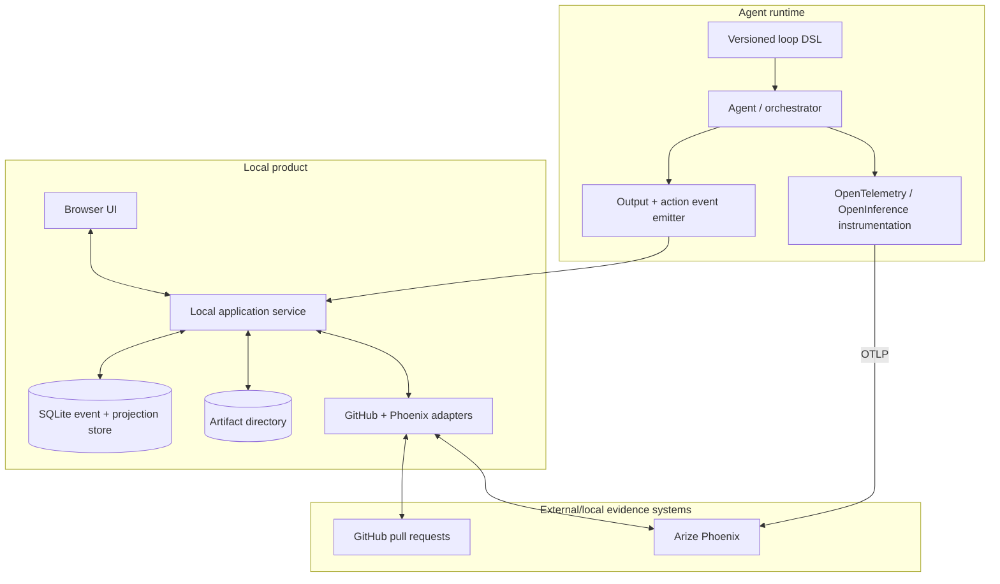
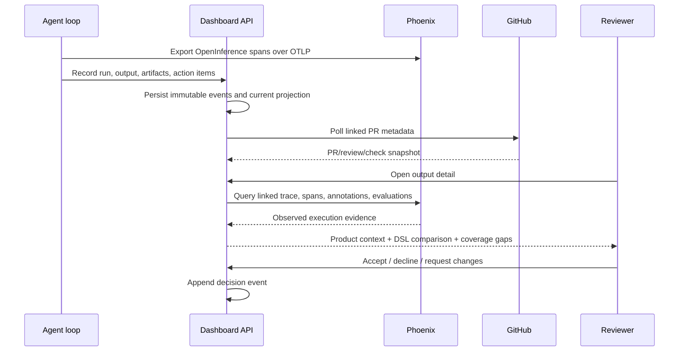

# Architecture

## Recommended boundary

The dashboard owns product state and review decisions. Phoenix owns AI execution telemetry. GitHub owns pull-request lifecycle. Agent runtimes own the meaning of their DSL and emit the identifiers needed to join these systems.



## Proposed stack

| Layer | MVP choice | Reason |
| --- | --- | --- |
| Browser | Semantic HTML, CSS, TypeScript | Local browser delivery with accessible native controls |
| UI structure | Small component layer; no heavy design system required | Keeps evidence and interaction logic inspectable |
| Graph rendering | SVG-based graph library behind an adapter | Supports keyboard labels, export, and explicit edge semantics |
| Local service | TypeScript on Node.js | One language across browser contracts, GitHub client, and Phoenix client |
| Product persistence | SQLite with migrations | Durable local state, relational joins, transactions, and simple backup |
| Artifact persistence | Content-addressed local files plus metadata in SQLite | Avoids bloating rows and preserves immutable reviewed versions |
| Trace backend | Pinned Arize Phoenix container | Local OpenInference/OTLP collection, trace inspection, annotations, and evaluations |
| Integration | Polling for GitHub; Phoenix REST/client queries | Works on localhost without requiring a public webhook endpoint |

An implementation may choose Python instead of TypeScript if adapter maturity proves materially better, but the data contracts and product boundaries should remain unchanged.

## Stateful event model

Current state is a projection of immutable domain events. This prevents a later synchronization from erasing what a reviewer saw or decided.

```text
output.created
output.version_added
output.submitted_for_review
action.created
action.state_changed
pull_request.linked
pull_request.snapshot_recorded
run.linked
decision.recorded
output.superseded
telemetry.coverage_assessed
```

Each event contains `event_id`, `entity_id`, `event_type`, `occurred_at`, `recorded_at`, `actor`, `source`, `payload`, and `schema_version`.

## Primary entities

| Entity | Purpose | Key joins |
| --- | --- | --- |
| LoopDefinition | Versioned declared workflow | DSL version → nodes and edges |
| LoopRun | One attempted execution | Output, Phoenix trace, DSL version |
| Output | Reviewable work product | Versions, PRs, actions, decision ledger |
| Artifact | Immutable file/JSON/link | Content hash, MIME type, provenance |
| ActionItem | Follow-up unit of work | Output, originating node/span, completion evidence |
| PullRequestSnapshot | GitHub state at a point in time | Output, repository, PR number |
| DecisionEvent | Human review result | Output version, actor, rationale |
| TraceLink | Phoenix locator | Run, project, trace ID, root span ID |
| TelemetryCoverage | Claim-level evidence status | Run/output, required signal, availability reason |

## Identity and join keys

Every agent loop integration should emit these IDs at output creation and add the same values to trace metadata:

```text
alo.loop_definition_id
alo.dsl_version
alo.run_id
alo.output_id
alo.output_version
alo.dsl.node_id
alo.dsl.edge_id          # when the transition itself is measured
alo.action_item_ids      # bounded list or artifact reference
github.repository        # when known
github.pull_request      # when known
```

The prefix is a project namespace, not an OpenInference standard. Standard OpenInference fields remain authoritative for span kind, inputs/outputs, model data, and token counts.

## Data flow



## Trace graph semantics

OpenInference trace parent/child structure is a tree. The declared DSL may be a DAG, and multiple runs or artifacts may also have cross-links. The UI therefore renders three separately identified edge types:

| Edge | Meaning | Source |
| --- | --- | --- |
| Solid directional | Observed parent/child execution | Phoenix span relationship |
| Thin directional | Declared workflow transition | Versioned DSL |
| Dashed directional | Explicit dependency or causal claim | App-owned, evidence-linked edge |

Temporal adjacency alone never creates a causal edge. Fan-in, fan-out, or cross-run dependencies require an explicit edge record.

## Privacy boundary

- Redact before OTLP export, not only during rendering.
- Store whether each value is `captured`, `redacted`, `not_instrumented`, `unavailable`, or `not_applicable`.
- Never capture credentials. Tool arguments/results use allowlists, size limits, and field-level masking.
- Content-addressed artifacts should support retention and explicit purge policies.
- The UI must not imply that a redacted or absent payload was empty.

## Failure behavior

- Phoenix unavailable: retain output/decision state and show trace evidence as stale or unavailable with last successful sync.
- GitHub unavailable: show cached PR snapshot and its timestamp.
- Agent event duplicated: require idempotency keys and reject conflicting payloads.
- Trace arrives after output: reconcile by `run_id` and `output_id` without blocking review.
- DSL node unmapped: render the observed span in an `Unmapped` lane; never hide it.
- Declared node not observed: render it as `Not observed`, which is distinct from `Not executed`.

